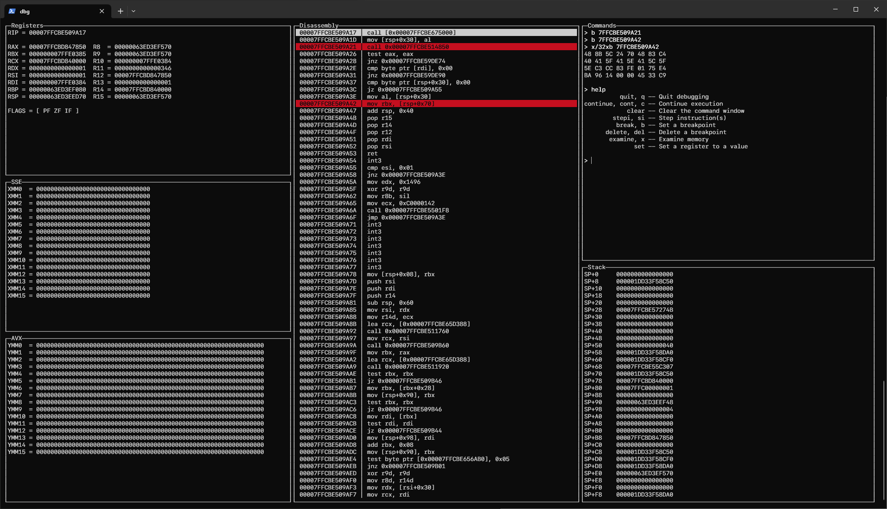

# mdbg - Cross platform TUI debugger

## Features
* Cross platform debugger (WIP)
* Automatic layout resizing
* User configurable layouts (WIP)
* Assembly level debugging
* Source level debugging (WIP)
* Should work with any terminal compatible with ncurses

## Supported commands
* Continue, step instruction, next instruction (step over call instructions)
* Set/delete breakpoints
* Examine memory (arbitrary length, in 8/16/32/64 bit pieces)
* Writing to registers

## TODO
* Ctrl-C interruption of the debuggee from the debugger
* Other exception types that can occur in the debugee should trigger the debugger (page faults, etc.)
* Status bar (showing whether the debugee is running/stopped, why it's stopped, etc.)
* x87 and other extension register views
* Symbol parsing (PDB/DWARF) and source level debugging
* User layout configurations from a config file
* Linux support

## Dependencies
* [pdcurses](https://pdcurses.org/) (Windows) or ncurses (Linux)
* [Zydis](https://github.com/zyantific/zydis) disassembler C library
